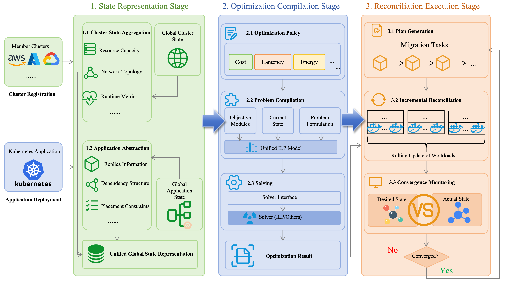
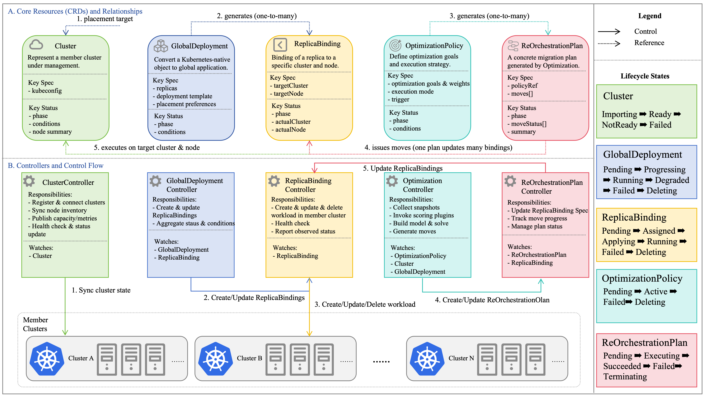
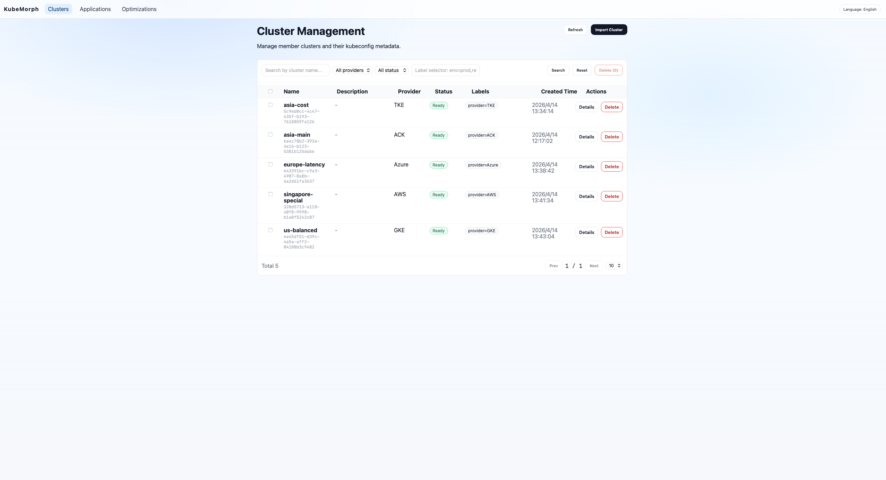
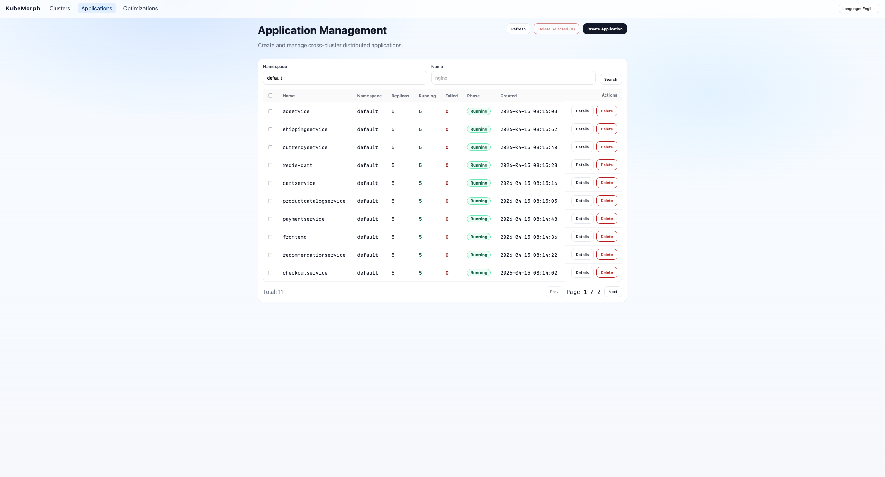
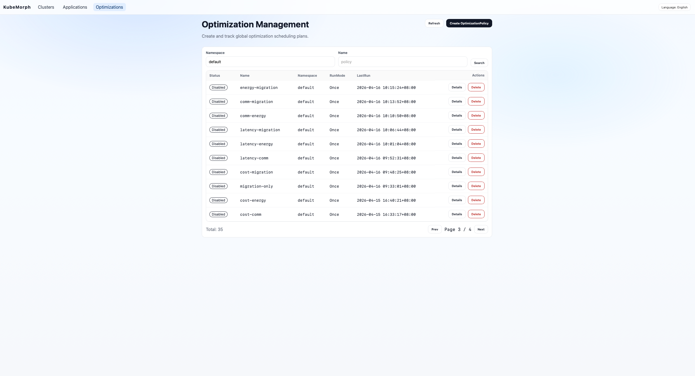

# KubeMorph

[English](README.md) | 简体中文

KubeMorph 是论文 **“KubeMorph: Optimization-as-Code for Multi-Cloud Multi-Objective Scheduling”** 的官方开源仓库。

它把“多云+多目标优化”抽象为一套 **Optimization-as-Code** 机制：

- 通过声明的方式描述优化目标、权重与数据源
- 支持自定义优化目标插件和优化算法
- 将集群状态与外部拓扑输入编译为可求解的优化问题
- 提供统一 REST API，并为前端提供可视化与运维入口
- Web UI 提供集群/应用/优化策略/优化结果的一站式管理

> 说明：本仓库当前为 **多模块（multi-module）Go 项目**，包含 `controller/` 与 `server/` 两个 Go module，以及 `web/` 前端工程。

## 🔎 Optimization-as-Code（OaC）范式

下图展示了我们 Optimization-as-Code（OaC）的阶段划分。

> 图片来源：**引用自我们的论文** “KubeMorph: Optimization-as-Code for Multi-Cloud Multi-Objective Scheduling”。



---

## ✨ 功能概览

- **多集群纳管**：注册/查看集群（Cluster）与拓扑信息
- **全局应用与分发对象管理**：创建与查询跨集群部署对象（如 `GlobalDeployment` 等）
- **优化策略管理**：创建/查看 `OptimizationPolicy`（多目标、可扩展）
- **优化与重编排计划**：生成/查看优化结果（如 `ReOrchestrationPlan`）
- **可视化**：Web UI 支持中英双语，展示多目标优化相关信息

---

## 🧩 仓库结构

```text
.
├── controller/   # Kubernetes Controller（kubebuilder/controller-runtime），定义 CRD 并执行调谐逻辑
├── server/       # 后端服务（Go + Gin），API + K8s 客户端适配
└── web/          # 前端（Vue 3 + Vite + TS + Ant Design Vue），可视化与交互
```

---

## 📚 CRD（自定义资源）

KubeMorph 使用 Kubernetes CRD 对系统中的关键对象建模（如集群、全局应用对象、优化策略、优化/重编排计划等）。

> 图片来源：**引用自我们的论文** “KubeMorph: Optimization-as-Code for Multi-Cloud Multi-Objective Scheduling”。



## 🏗️ 系统架构（高层）

典型链路：

1. 用户通过 **Web UI** 或直接提交 YAML 创建/更新 CR（例如 `OptimizationPolicy`）
2. **Controller** 监听 CR 与集群对象变化，生成/更新调度优化与重编排计划
3. **Server** 提供 REST API & 统一数据访问层（etcd），并对接 Kubernetes（读写/应用变更）
4. Web UI 调用 Server API 展示状态、计划与结果

---

## 🚀 快速开始（推荐：本地 Docker 启动后端 + 本地启动前端）

下面给出一条对开源用户最友好的启动路径：

### 1) 启动 server（含 etcd）

`server/` 目录提供了 `docker-compose.yml`，会启动REST API 服务（默认监听 `:8080`）

在仓库根目录执行：

```bash
cd server
docker compose up --build
```

服务默认端口：`http://localhost:8080`

> 配置参考：`server/config.example.yaml`

### 2) 启动 web（前端开发模式）

```bash
cd web
npm install
npm run dev
```

启动后按 Vite 输出的地址访问即可（通常是 `http://localhost:5173`）。

### 3) 启动 controller（本地连接集群）

Controller 位于 `controller/`，负责监听/调谐 KubeMorph CRD（如 `Cluster`、`GlobalDeployment`、`ReplicaBinding`、`OptimizationPolicy` 等）。

本地运行（连接到当前 kubeconfig 指向的集群）：

```bash
cd controller
make run
```

安装 CRD 并部署到集群（更贴近生产）：

```bash
cd controller
make install
make deploy
```

> 小提示：如果你只需要验证编译是否通过，可运行 `go test ./... -run '^$'`（仅编译不执行测试）。

---

## 🖥️ Web UI 界面截图

Web UI 提供集群、应用与优化策略/结果的一站式管理。

### 集群管理



### 应用管理



### 优化管理



## 📦 生产部署建议

### Web（Nginx 静态托管 + 反向代理）

`web/` 目录已包含生产镜像 Dockerfile，默认通过 Nginx 托管静态资源，并可将 `/api/*` 代理到后端 Server。

构建：

```bash
cd web
docker build -t kubemorph-web:latest .
```

运行（示例）：

```bash
docker run --rm -p 8080:80 \
  -e BACKEND_SERVICE_HOST=kubemorph-server \
  -e BACKEND_SERVICE_PORT=8080 \
  -e BACKEND_API_PREFIX=/api \
  -e BACKEND_API_VERSION_PREFIX=/api/v1 \
  kubemorph-web:latest
```

> 详细参数说明见 `web/README.md`。

### Controller（部署到 Kubernetes 集群）

Controller 位于 `controller/`，基于 Kubebuilder 脚手架，支持：

- 安装 CRD：`make install`
- 部署 controller：`make deploy IMG=<your-registry>/kubemorph-controller:<tag>`

示例（需要你把镜像推到可被集群拉取的仓库）：

```bash
cd controller
make docker-build docker-push IMG=<your-registry>/kubemorph-controller:latest
make install
make deploy IMG=<your-registry>/kubemorph-controller:latest
```

### Server（生产）

Server 位于 `server/`，提供 REST API。本仓库提供 `server/docker-compose.yml` 作为最小可用的生产/演示部署模板。

启动（示例）：

```bash
cd server
docker compose up -d
```

默认端口：

- Server：`http://localhost:8080`

关键配置参考：

- `server/config.example.yaml`
- `server/docker-compose.yml`

---

## 🔌 优化插件扩展（目标插件 / 求解器后端）

这一节说明如何基于仓库现有实现扩展“优化目标”和“求解器后端”。相关代码主要在 `controller/internal/optimizer/`。

### 1) 自定义优化目标插件接入

目标得分由插件计算，再由聚合器加权汇总。

插件接口定义在 `controller/internal/optimizer/plugins.go`：

- `LinearScorePlugin`：输出每个 replica 在每个候选节点上的线性分值（通常归一化到 0~100）
- `MigrationScorePlugin`：输出每个 replica 的迁移惩罚系数

参考实现：`controller/internal/optimizer/plugin_cost.go`（CostPlugin）。它要求节点带有 `node.kubex.io/type` 标签，并通过实例单价表计算成本分值。

自定义插件接入：

1. 在 `controller/internal/optimizer/` 新增 `plugin_<name>.go`，实现 `LinearScorePlugin`
2. 如需外部数据输入，扩展 `ObjectiveInputs`（`controller/internal/optimizer/objective.go`）以把数据带进来
3. 在 `BuildObjective(...)`（同文件）里为新的 `WeightedGoal.Type` 增加分支，把插件输出按 `Weight` 加权合并

当前聚合规则（按源码实现）：

- placement 目标：合并到同一个 `placementScore[replica][node]` 矩阵中（线性项）
- migration 目标：单独生成 `migrationPenalty[replica]`，在求解阶段作为额外线性项引入

### 2) 优化算法/求解器后端（Solver）

求解器通过 `Solver` 接口抽象（`controller/internal/optimizer/ilp.go`）：

- `Solve(ctx context.Context, p Problem) (*SolveResult, error)`

上层调用入口为 `SolveProblem(...)`，它会构建 ILP 模型并调用 solver。

#### OR-Tools（可选）

仓库包含一个可选 OR-Tools 后端，使用 build tag 控制：

- 默认（不带 tag）：`ORToolsSolver` 为 stub（`ortools_solver_stub.go`），会提示需要 `-tags=kubex_ortools`
- 启用 tag：编译 `ortools_solver_cgo.go`（需要 cgo + 本机/镜像中安装 OR-Tools，且 include/lib 路径可用）

如果你要接入新的求解器（启发式/其他 ILP 求解器等），实现 `Solver` 并在优化入口处注入调用即可。

---

## 📄 论文引用

如果你在研究工作中使用了本项目，欢迎引用我们的论文：

> KubeMorph: Optimization-as-Code for Multi-Cloud Multi-Objective Scheduling

（BibTeX 待补充）

---

## 🤝 Contributing

欢迎提 Issue / PR。

建议贡献流程：

1. Fork 仓库并创建 feature branch
2. 代码格式化与静态检查：
	- `controller/`: `make fmt vet`
	- `web/`: `npm run lint` / `npm run format`
3. 跑基础测试：
	- `server/`: `go test ./...`
	- `controller/`: `make test`

---

## License

见仓库根目录 `LICENSE`。
